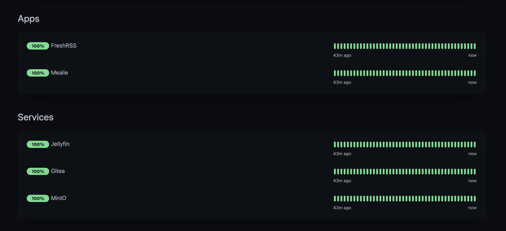

+++
date = '2025-06-13T16:00:00+01:00'
title = 'Homelab V1'
tags = ['homelab']
+++

My Homelab has hit its first milestone 🚀

## Cloud

The biggest problem with my homelab was that I kept breaking it. 

I couldn't get used to using [mealie](https://mealie.io/) as a meal planner because I would go to use it and it didn't work. Or it did, but I couldn't connect to it properly. Or something else went wrong.

So for my first "release" I aimed for a "cloud". Some people call it "HomeProd".

I used things I was used to, and a few things I wasn't, to make a simple, stable platform on which I could host my _actual_ homelab.

Here's what's in it:

### NAS

I have a machine dedicated to running [TrueNAS Scale](https://www.truenas.com/truenas-scale/).

I bought the hype that I needed [ECC RAM](https://www.truenas.com/docs/scale/gettingstarted/scalehardwareguide/) so that my data would be safe and so I also needed a server-grade processor, which meant a server-grade motherboard, and all the other bits to go with it.

At the time Scale had built-in Kubernetes so I used TrueCharts to set up some apps. And then they stopped working. And then there were all the updates with breaking changes. And then I got fed up.

This was meant to be a machine that did storage and I didn't want to mess with it.

The TrueNAS devs thought the same thing and took out Kubernetes and replaced it with Docker, so I updated to follow and now I only run two storage apps on it.

#### Usage

- **file storage** over **NFS** to Linux and Mac and **SMB** for Windows
- **object storage** via [MinIO](https://min.io) installed as a Docker container
- **backups** for virtual machines via [Proxmox Backup Server](https://www.proxmox.com/en/products/proxmox-backup-server/overview)

and nothing else, because I just want it to do network attached storage, and I don't want to mess with it.

#### Storage

- 2 NVME for 4TB of fast storage
- 1 SSD for 500GB internal storage
- 4 HDD RAIDZ2 for 10TB of slow storage

### NUC

After getting burned trying to do server things on my NAS I looked for a replacement and found the [Turing Pi](https://turingpi.com), and then in true Kickstarter fashion it got delayed, and then delayed again.

I impatiently bought an Intel NUC.

I _could_ have installed Linux on it and used it as a server but I wanted to use Terraform for Infrastructure as Code, so instead I installed [Proxmox VE](https://www.proxmox.com/en/products/proxmox-virtual-environment/overview) and used Terraform to create the virtual machines and LXC containers I needed with code.

This meant I could get some practise in using [Ansible](https://docs.ansible.com/ansible/latest/index.html) to configure things and try out [K3s](https://k3s.io) to run Kubernetes.

#### Usage

- **compute** for running services and apps
- experience using **Proxmox**
- practise using IaC with **Terraform** and **Ansible**
- a place to try out **Kubernetes** stuff
- a better GPU than the NAS for **Jellyfin** to use for transcoding

#### Services

- **[Pi-hole](https://pi-hole.net/)** for blocking adverts as well as DNS and DHCP for my network
- **[Wireguard](https://www.pivpn.io/)** for a VPN so I can connect from out the house
- **MySQL** and **Postgres** databases for "cloud" things to use
- **[Caddy](https://caddyserver.com/)** as a reverse proxy to provide access to my "cloud" apps and services
- **[Gitea](https://about.gitea.com/)** for storing my git repositories
- **[Jellyfin](https://jellyfin.org/)** to watch my own media content

#### Apps

- **[Mealie](https://mealie.io/)** for recipe management and meal planning
- **[FreshRSS](https://www.freshrss.org/)** for my RSS clients to sync from

### DeskPi

The last part of my "cloud" is the Raspberry Pi 4 I have on my desk.

(I named it before I heard about the company with the same name)

I had future plans for it, since it's sat on my desk, so I installed the desktop version of Ubuntu and hooked it up to my second screen. 

Then I installed [Uptime Kuma]() on it to monitor all my services and apps.

Apparently I cheaped out when I bought it and got the 2GB version, so it's really really slow and struggles with showing the dashboard.

I've been looking for a good excuse to buy a Raspberry Pi 5 but technically this works, so for now it can stay.

## Lab

Now that the stable self-hosted part is out of the way I'm going to leave it alone and use something else for the new ideas.

My Turing Pi 2.5 has finally arrived, along with its case, 3 x [RK1](https://turingpi.com/product/turing-rk1/?attribute_ram=8+GB) compute modules and 3 x 1 TB  NVME drives. I'm planning on using it as a cluster to run Kubernetes and potentially host my own website, but we'll see about that.

Right now it's on the bench in the lab.
