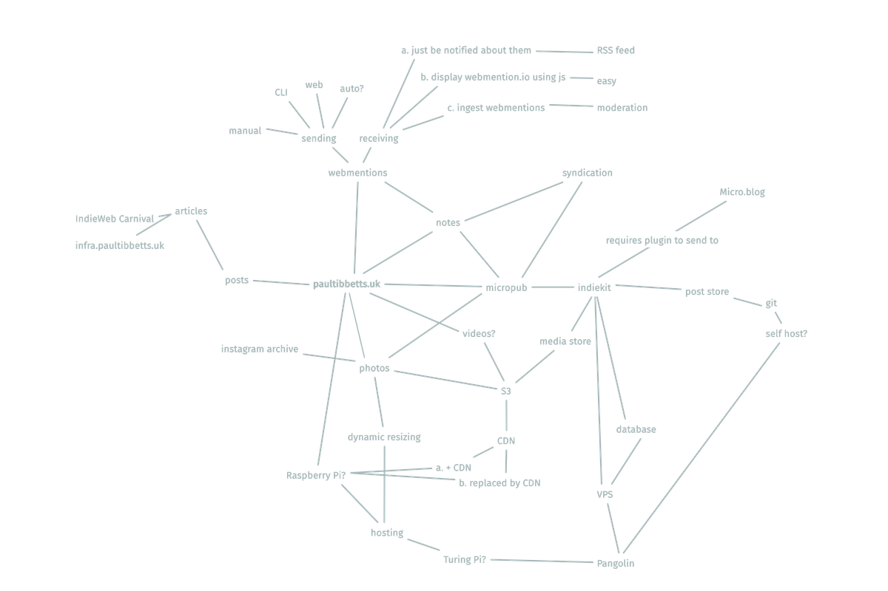

+++
date = '2026-03-14T23:07:25Z'
draft = false
title = 'Changes to the Site'
tags = ['meta']
summary = "I've made some recent changes to the site and have a few ideas for what comes next."
+++

I've made some recent changes to the site and have a few ideas for what comes next.

Changes:

- Notes: shorter posts that don't need titles
- Bookmarks and likes: a way to share links without writing full posts
- Replies: posts that are part of a conversation with another site
- Webmentions: now appear below posts

Ideas:

- serving media through a CDN
- dynamic image resizing with imgproxy
- publishing from my phone using micropub

<!--more-->

## Notes

My site now has [notes](https://indieweb.org/note). They are still posts but I treat them a bit differently.

Notes don't need a title, and they're usually shorter, but they're effectively the same as the articles I've already been posting. The real difference will be what I end up classing as an article instead of a note.

I added them because I wanted to post moments in time without needing to write several paragraphs like I would in an article. This post was nearly a note, until I realised it was more than just recent changes and that I could write about future ones as well.

I think I will probably end up writing less articles now I have notes but when I do write an article it should mean that it's taken more effort to write, and is therefore of higher quality, but I'm not guaranteeing anything.

## Bookmarks

I've also added [bookmarks](https://indieweb.org/bookmark), which I'm going to use to share links to interesting things around the web.

These are notes with a `bookmark_of` field set to the URL I've bookmarked. They are then displayed a little differently, with the link going to the bookmarked site instead of my own post.

```html
<a class="u-bookmark-of" href="https://example.com/post">Example</a>
```

Using a different post kind for this makes it easier for me to share links, since I don't need to write an article talking about it, or even a note saying what I like about it. I can just share the link.

## Likes

Another type of link I'm going to share is a [like](https://indieweb.org/like), which is both a reaction and me sharing something. I don't know if there's going to be a system for deciding whether something is a bookmark or a like so I will make it up as I go along.

```html
<a class="u-like-of" href="https://example.com/post">I liked this</a>
```

Because I don't know what the difference will end up being, and they're both just a link to something, I have also added a [/links](/links) feed which includes both bookmarks and likes.

This will be my own curated version of the internet I want others to know about.

## Webmentions

Speaking of likes, I got my first webmention like! Thank you [Joe](https://artlung.com/)!

I was checking Google Search Console and found a page showing me what sites linked to mine when I saw Joe had [liked one of my posts](https://artlung.com/likes/2f08886085fe293d93bce727c2f75051).

I run my own site because I enjoy doing so, but that interaction made it all seem worth it, and I want to post likes from my own site to share that with others going forward.

### webmention.io

Joe was able to send me a like because I signed up to [webmention.io](https://webmention.io), which now collects my [webmentions](https://indieweb.org/webmention/) for me.

It also provides a feed showing all the webmentions my site has received, which I've added to my reader so I'm notified of new ones.

To display the webmentions on my site I'm using [webmention.js](https://github.com/PlaidWeb/webmention.js/) to show them below the post they are mentioning.

## Replies

The other post type I've added recently is a [reply](https://indieweb.org/reply/).

These are notes that are in response to someone else's post. I will use webmentions to tell them that I've written it, after which they could display my reply as a comment.

This now means that to write about a link I could:

- write an article about it
- share it as a bookmark
- share it as a like
- write a note about it
- reply to it directly

So to try and make a rule for them: replies are notes that are part of a conversation.

Where it gets confusing is that any type of post can also be a reply. I could publish a post as an article, and then include a line like

```html
my entry for
<a class="u-in-reply-to" href="https://carnival.host/prompt.html">this month's IndieWeb Carnival</a>
```

and the post would be both an article and a reply.

If the site I'm replying to displayed my article in full, it might be as long as their original post. Because of that they might show only an excerpt, or just link to it instead.

So, for long articles that are technically also replies I will have to make sure I write a shorter summary that works well as a comment, which could be displayed in full.

The replies I write using the reply post type will be written as I want them to appear in the conversation.

## Planned changes

My entry for this month's [IndieWeb Carnival](https://indieweb.org/IndieWeb_Carnival/) is taking longer than I thought because it's turned into a holiday photo dump.

This has had me questioning my setup, which is annoying because I thought it would last a bit longer before it needed changing.



I have not even finished my post about [infra.paultibbetts.uk](https://infra.paultibbetts.uk/), which documents my infrastructure, and I am already thinking of changing it.

I do enjoy working on my site, maybe even more than actually using it, but I have other things I should be working on.

I don't know when the following will get done.

## Media

My draft Carnival post was starting to include photos from my phone, which were about 7 MB each. I hadn't thought about photos before and didn't have a process for them.

My site uses git for version control, which is great for text like code and content but it starts to get bloated when you fill it with 7 MB photos. I started thinking up a better system for this, which is coming up next, until I realised I could optimise my images before saving them in git.

The solution for now is to run a script that replaces the original image with a compressed version. The 7 MB photos shrink down to ~200 kB. I am still bloating my repo with images, but at a much more tolerable size.

## CDN

A better solution is to store my photos separately, which lets me keep the repo slim by tracking only text files.

I could use [my Raspberry Pi](/2026/02/19/moved-my-website-from-github-pages-to-a-raspberry-pi/) to host the photos, but it uses Network File Storage which is a bit slow and has only 50 GB of storage.

Instead I'm thinking of using a storage bucket, which could grow to any size, and then using a Content Delivery Network to serve the assets.

## Dynamic Image Resizing

I might also use something like [imgproxy](https://imgproxy.net/) to dynamically resize images.

When a user requests a smaller version of a photo, imgproxy would generate it on demand. That resized image would then be cached by the CDN, so future visitors can receive the optimised version immediately.

This _might_ mean I can stop compressing photos manually and just use the originals.

## Micropub

The final change to my site, which will really elevate it from a simple blog to a personal publishing system, is using [micropub](https://indieweb.org/micropub) to let me post from my phone.

This would need hosting and hooking up to my git repo to manage my content. I would have the same problem as I do right now if I used it for photos, so I will need to wait until I have the storage bucket and CDN sorted before tackling this.

I'm considering using [Indiekit](https://getindiekit.com/) as my micropub server, as it works with Hugo (which powers my site), and can also [syndicate](https://indieweb.org/cross-posting) my posts out to social networks. It doesn't look like it has a Micro.blog plugin yet, so I'd need to write one before I can selectively choose which posts to syndicate there.

## Micro.blog

Which leaves me with a site that can do what I currently use my [Micro.blog](https://micro.blog) [microblog](https://micro.paultibbetts.uk/) for. I want to stay as part of the Micro.blog community, and will continue using their apps, but I can see myself migrating the hosting of my content to my own site in the future.

I could merge my Micro.blog posts into the notes on my own site and then syndicate future posts to the Micro.blog timeline, and for Micro.blog users nothing will seem to have changed, only where my content is hosted.

My feed might even get better, as I could filter out posts that I know the Micro.blog community wouldn't be interested in.

This isn't a remark against Micro.blog by the way - I think it's an excellent service - I just believe that I was destined to outgrow it, since I always intended on working on my own site. I think of it more as graduating as a socially-capable indie website, and because Micro.blog is part of the indieweb I can stay part of its community.

I would be missing out on lots of features that Micro.blog has that I don't yet support, so it wouldn't be a seamless transition, but after implementing all the above ideas my site should be capable of hosting all of my post kinds in one place.
