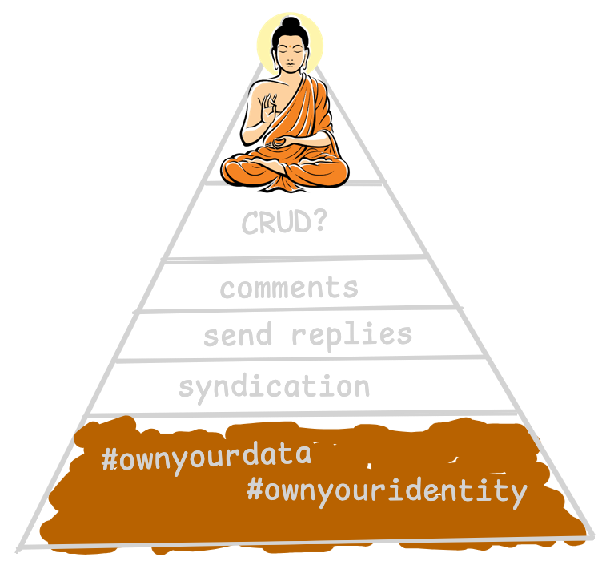

+++
title = "IndieMark"
type = "page"
show_in_pages_nav = false
+++

[IndieMark](https://indieweb.org/IndieMark) is an _in-progress_ developer guide that organises the [building blocks](https://indieweb.org/Category:building-blocks) that make up an IndieWeb site.

I currently get **1.2** points.

## Level 0

### Owning your own domain ✅

I have [written about getting my own domain](https://paultibbetts.uk/2025/09/09/getting-my-own-domain/).

### Having a personal site at that domain ✅

You're looking at it!

## Level 1

### Identity ✅

You're reading this on my primary domain. 

### Authentication ✅

#[e5e1d75](https://github.com/paultibbetts/paultibbetts.uk/commit/e5e1d7547f4b533db7e4ad80ca6d882bb278507f) added [`rel-me`](https://indieweb.org/rel-me) links to GitHub and Micro.blog.

### Posts

with **permalinks**, **h-entry** markup and other **microformats** ✅

#[24f53f0](https://github.com/paultibbetts/paultibbetts.uk/commit/24f53f0ca9101648c52cfc71438aba29f4c1e48e) added microformats to my posts.

### Searchable

by **allowing robots to index my site**, my **content is written in HTML** and **no JavaScript is required to read it** ✅

#[e5e1d75](https://github.com/paultibbetts/paultibbetts.uk/commit/e5e1d7547f4b533db7e4ad80ca6d882bb278507f) does all of the above.

## Level 2

The wiki defines level 2 as:

> much more than just "I started a blog"

### h-card

contact info and representative icon on my home page ✅

#[24f53f0](https://github.com/paultibbetts/paultibbetts.uk/commit/24f53f0ca9101648c52cfc71438aba29f4c1e48e) added a [`h-card`](https://indieweb.org/h-card) to the home page.

### Post multiple types of posts ❌

Right now I only post "[articles](https://paultibbetts.uk/articles)".

I am considering adding bookmarks and likes.

Notes are currently posted on my [microblog](https://micro.paultibbetts.uk), I will _maybe_ also/instead post them from this site **after** I deal with webmentions.

### POSSE to silos ❌

My blog's RSS feed is picked up by [Micro.blog](https://micro.blog) who then posts new entries to the timeline and also cross-posts them to my Mastodon and Bluesky accounts.

It does not return the URLs of any of those posts so I cannot add the links to them to my own posts as syndicated copies.

I award myself 0.05 points for POSSEing out but considering I don't link to the syndicated copies I will round it down to 0.

### Navigate across posts ❌

Apparently I can do this with [Hugo's Related Content](https://gohugo.io/content-management/related-content/). I will get around to this.

### Have a UI for searching ❌

Not yet.

